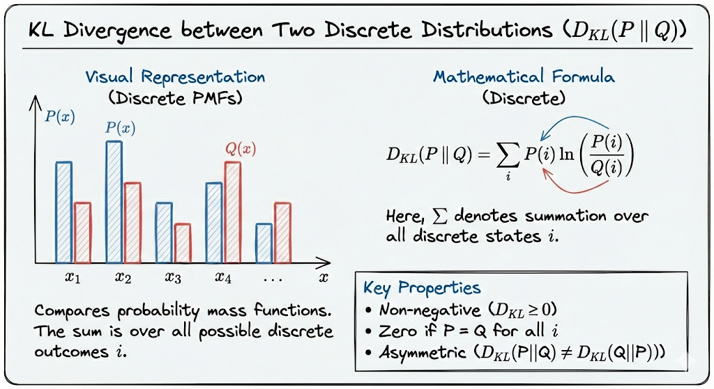
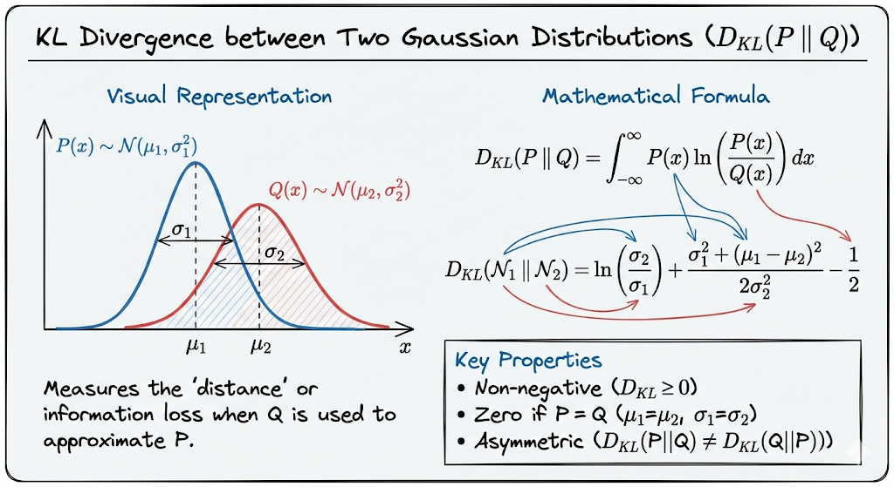
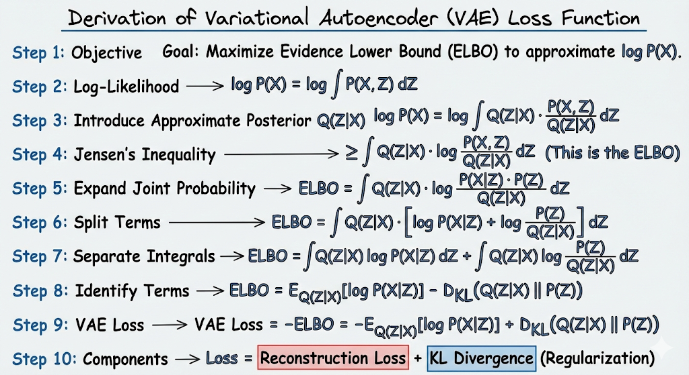
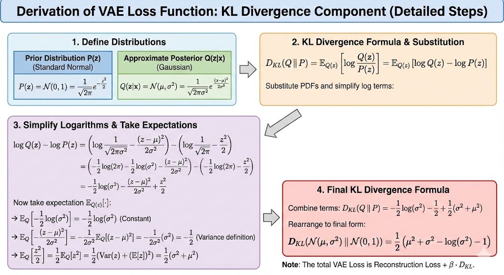
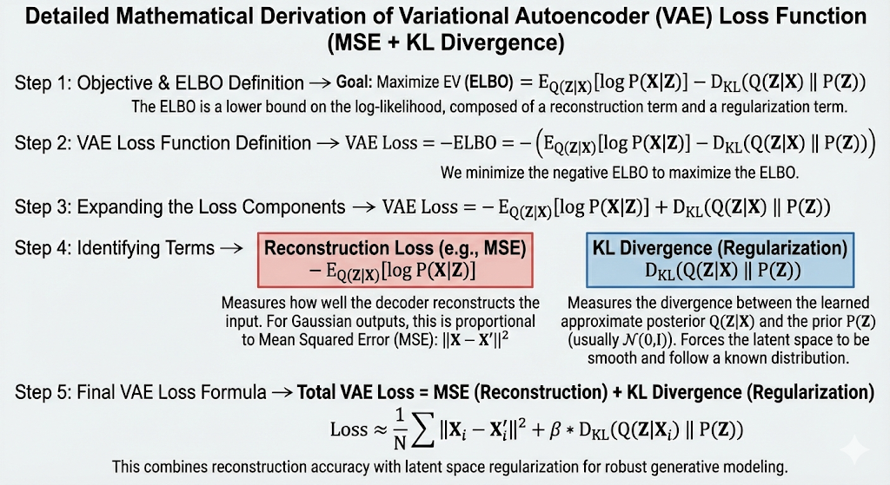
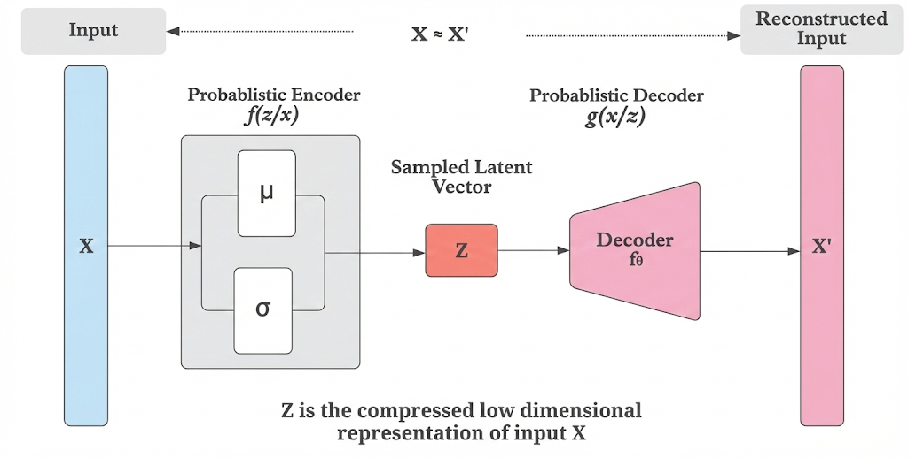

# AutoEncoders

**Learning Representation Through Encoding and Decoding**

---

## Overview

Autoencoders are a family of unsupervised neural networks that learn efficient, compressed representations of input data. They consist of two main components:

- **Encoder**: Maps the input to a lower-dimensional latent space
- **Decoder**: Reconstructs the input from the latent representation

This folder contains from-scratch PyTorch implementations of multiple autoencoder variants, progressing from deterministic to probabilistic to discrete representations.

---

## Visual Overview

### Autoencoders vs VAE

<p align="center">
  
</p>

### KL Divergence

<p align="center">
  
</p>

<p align="center">
  
</p>

### VAE Loss (ELBO)

<p align="center">
  
</p>

<p align="center">
  
</p>

<p align="center">
  
</p>

---

## Implementations

### [Vanilla Autoencoder](Vanilla%20Autoencoder/)

Deterministic autoencoder with fully-connected layers. Encodes 784D inputs to a 32D latent space using MSE loss. Trained on MNIST and FashionMNIST.

### [Variational Autoencoder (VAE)](VAE/)

Probabilistic autoencoder that learns a latent distribution (mean and log-variance) using the reparameterization trick. Uses BCE + KL divergence loss. Trained on FashionMNIST with a 128D latent space.

<p align="center">
  
</p>

### VQ-VAE *(Coming Soon)*

Vector Quantized VAE with discrete codebook-based latent representations.

### RVQ *(Coming Soon)*

Residual Vector Quantization — multi-stage quantization for hierarchical discrete representations.

---

## Folder Structure

```
AutoEncoders/
├── README.md
├── images/
│   ├── VAE.png
│   ├── autoencoders vs vae.png
│   ├── kl_div_discrete.png
│   ├── kl_div_gaussian.png
│   ├── vae_loss.png
│   ├── vae_loss_derivation.png
│   └── vae_loss_elbo.png
├── Vanilla Autoencoder/
│   ├── README.md
│   ├── AutoEncoders_coding.ipynb
│   ├── Autoencoders overview.png
│   ├── Autoencoders.excalidraw
│   └── AutoEncoders paper.pdf
├── VAE/
│   ├── README.md
│   ├── VAE_from_scratch.ipynb
│   ├── VAE architecture.png
│   ├── VAE architecture overview.excalidraw
│   └── VAE paper.pdf
├── VQ-VAE/                          (Planned)
└── RVQ/                             (Planned)
```

---

## References

| Resource | Link |
|----------|------|
| Autoencoder (Wikipedia) | [en.wikipedia.org/wiki/Autoencoder](https://en.wikipedia.org/wiki/Autoencoder) |
| VAE Paper (Kingma & Welling, 2013) | [arxiv.org/abs/1312.6114](https://arxiv.org/abs/1312.6114) |
| Tutorial on VAEs (Doersch, 2016) | [arxiv.org/abs/1606.05908](https://arxiv.org/abs/1606.05908) |
| Understanding VAEs | [lilianweng.github.io](https://lilianweng.github.io/posts/2018-08-12-vae/) |
| PyTorch Documentation | [pytorch.org](https://pytorch.org/) |
