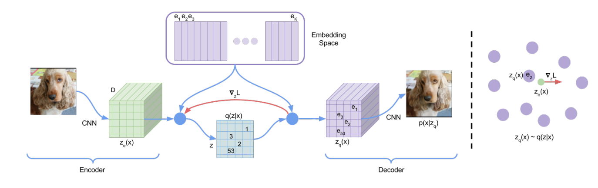
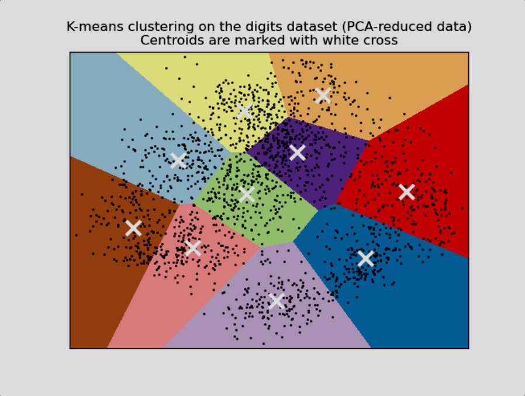
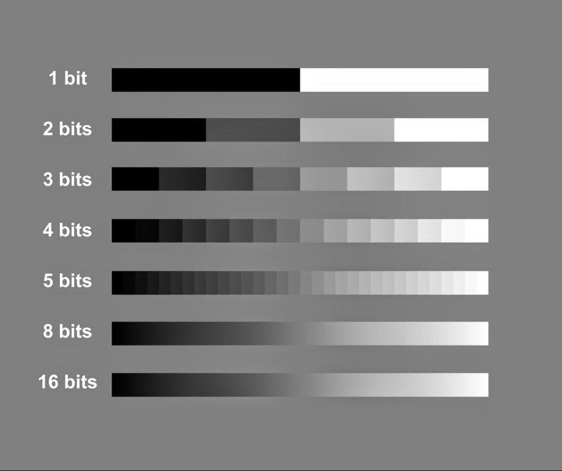

# Vector Quantized Variational Autoencoder (VQ-VAE)

**Learning Discrete Latent Representations via Vector Quantization**

---

## Table of Contents

1. [Overview](#overview)
2. [Theory & Math](#theory--math)
   - [From Continuous to Discrete Latents](#from-continuous-to-discrete-latents)
   - [Vector Quantization & K-Means Intuition](#vector-quantization--k-means-intuition)
   - [VQ-VAE Loss Function](#vq-vae-loss-function)
   - [Straight-Through Estimator](#straight-through-estimator)
   - [Bit Depth & Codebook Capacity](#bit-depth--codebook-capacity)
3. [Architecture](#architecture)
4. [Implementation Details](#implementation-details)
5. [Notebook](#notebook)
6. [Files](#files)
7. [References](#references)

---

## Overview

While standard VAEs learn **continuous** latent distributions (mean and variance), VQ-VAE learns a **discrete** latent space using a learnable **codebook** of embedding vectors. Each encoder output is mapped to its nearest codebook entry via vector quantization, producing a discrete bottleneck.

This approach offers several advantages:

- **Avoids posterior collapse**: unlike VAEs, VQ-VAE does not suffer from the KL vanishing problem
- **Discrete representations**: naturally suited for language, audio, and other discrete modalities
- **High-quality reconstruction**: codebook vectors concentrate information, leading to sharp outputs
- **Foundation for generation**: paired with autoregressive priors (e.g. PixelCNN), VQ-VAE enables powerful generative modeling

### VQ-VAE Architecture Overview

<p align="center">
  
</p>

---

## Theory & Math

### From Continuous to Discrete Latents

In a standard VAE, the encoder outputs μ and log σ² to parameterize a continuous Gaussian distribution. In VQ-VAE, the encoder outputs a **continuous vector** `z_e(x)`, which is then **quantized** by snapping it to the nearest vector in a learned codebook:

```
z_q(x) = e_k,   where k = argmin_j || z_e(x) - e_j ||²
```

This discrete mapping replaces the reparameterization trick entirely.

### Vector Quantization & K-Means Intuition

Vector quantization is conceptually similar to **K-Means clustering** — the codebook vectors act as cluster centroids in the latent space, and each encoder output is assigned to its nearest centroid.

<p align="center">
  
</p>

### VQ-VAE Loss Function

The VQ-VAE loss has three components:

```
L = L_reconstruction + L_codebook + β · L_commitment
```

| Component | Formula | Purpose |
|-----------|---------|---------|
| **Reconstruction Loss** | `MSE(x, x̂)` | Reconstruct the input faithfully |
| **Codebook Loss** | `‖ sg[z_e(x)] - e_k ‖²` | Move codebook vectors toward encoder outputs |
| **Commitment Loss** | `‖ z_e(x) - sg[e_k] ‖²` | Prevent encoder outputs from drifting away from codebook |

Where `sg[·]` denotes the **stop-gradient** operator (detach in PyTorch).

```python
# From models.py
codebook_loss = torch.mean((codes - z.detach())**2)
commitment_loss = torch.mean((codes.detach() - z)**2)
```

### Straight-Through Estimator

Since `argmin` is non-differentiable, VQ-VAE uses the **straight-through estimator** — gradients from the decoder are passed directly to the encoder, bypassing the quantization step:

```python
# Straight-through: copy gradients from codes to z
codes = z + (codes - z).detach()
```

This means in the forward pass, the decoder receives the quantized codes `z_q`, but in the backward pass, the gradients flow as if `z_q = z_e` (the encoder output).

### Bit Depth & Codebook Capacity

The number of discrete states a codebook can represent depends on its size. With a codebook of size `K`, each spatial position encodes `log₂(K)` bits of information.

<p align="center">
  
</p>

---

## Architecture

The implementation provides both **Linear** and **Convolutional** variants:

### VQ-VAE Architecture Diagram

<p align="center">
  
</p>

### Linear VQ-VAE

```
Input (784) ──► Encoder ──► z_e (latent_dim) ──► VQ ──► z_q ──► Decoder ──► Output (784)
  Flatten                                      ↕                              Sigmoid
  28×28                                    Codebook                         Reconstruct
                                          (K vectors)
```

| Component | Architecture |
|-----------|-------------|
| **Encoder** | Linear(784→128) → ReLU → Linear(128→64) → ReLU → Linear(64→32) → ReLU → Linear(32→latent_dim) |
| **Vector Quantizer** | Codebook of `K` vectors, each of dimension `latent_dim` |
| **Decoder** | Linear(latent_dim→32) → ReLU → Linear(32→64) → ReLU → Linear(64→128) → ReLU → Linear(128→784) → Sigmoid |

### Convolutional VQ-VAE

| Component | Architecture |
|-----------|-------------|
| **Encoder** | Conv2d(1→8, k=3, s=2) → BN → ReLU → Conv2d(8→16, k=3, s=2) → BN → ReLU → Conv2d(16→latent_dim, k=3, s=2) → BN → ReLU |
| **Vector Quantizer** | Codebook of `K` vectors; applied per-spatial-position (reshapes B×C×H×W → (B·H·W)×C for quantization) |
| **Decoder** | ConvTranspose2d(latent_dim→16, k=3, s=2) → BN → ReLU → ConvTranspose2d(16→8, k=3, s=2) → BN → ReLU → ConvTranspose2d(8→1, k=3, s=2) → Sigmoid |

---

## Implementation Details

| Parameter | Linear VQ-VAE | Conv VQ-VAE |
|-----------|--------------|-------------|
| **Dataset** | FashionMNIST (32×32) | FashionMNIST (32×32) |
| **Latent Dim** | 2 | 4 |
| **Codebook Size** | 512 | 512 |
| **Reconstruction Loss** | MSE | MSE |
| **VQ Loss** | Codebook + Commitment | Codebook + Commitment |
| **Optimizer** | Adam | Adam |

### Key Modules

| Module | File | Description |
|--------|------|-------------|
| `VectorQuantizer` | [models.py](models.py) | Codebook lookup with efficient distance computation |
| `LinearVectorQuantizedVAE` | [models.py](models.py) | Fully-connected encoder/decoder with VQ bottleneck |
| `ConvolutionalVectorQuantizedVAE` | [models.py](models.py) | Convolutional encoder/decoder with per-spatial VQ |
| Utilities | [utils.py](utils.py) | Loss functions, latent space visualization, interpolation |

### Efficient Distance Computation

The `VectorQuantizer` implements an efficient distance computation avoiding memory-heavy broadcasting:

```python
# (z - e)² = z² - 2·z·eᵀ + e²
L2 = torch.sum(x**2, dim=1, keepdim=True)           # [B, 1]
C2 = torch.sum(self.embedding.weight**2, dim=1)      # [K]
CL = x @ self.embedding.weight.t()                   # [B, K]
distances = L2 - 2*CL + C2                           # [B, K]
```

---

## Notebook

**Notebook**: [Vector_Quantized_Variational_AutoEncoders.ipynb](Vector_Quantized_Variational_AutoEncoders.ipynb)

The notebook covers the full progression from vanilla autoencoders to VQ-VAE:

1. **Vanilla AE** — Linear and convolutional autoencoders as baselines
2. **VAE** — Variational autoencoders with reparameterization trick
3. **VQ-VAE** — Vector quantized models with codebook learning
4. **Training** — End-to-end training on FashionMNIST
5. **Visualization** — Latent space embeddings, reconstructions, and latent space interpolation
6. **Comparison** — Side-by-side comparison across all three autoencoder families

---

## Files

| Resource | File | Description |
|----------|------|-------------|
| Implementation Notebook | [Vector_Quantized_Variational_AutoEncoders.ipynb](Vector_Quantized_Variational_AutoEncoders.ipynb) | Full implementation with training and visualization |
| Models | [models.py](models.py) | All model classes (AE, VAE, VQ-VAE) |
| Utilities | [utils.py](utils.py) | Loss functions and visualization helpers |
| Research Paper | [VQVAE paper.pdf](VQVAE%20paper.pdf) | Original VQ-VAE paper (van den Oord et al., 2017) |

---

## References

| Resource | Link |
|----------|------|
| Neural Discrete Representation Learning (van den Oord et al., 2017) | [arxiv.org/abs/1711.00937](https://arxiv.org/abs/1711.00937) |
| Understanding VQ-VAE | [ml.berkeley.edu/blog/posts/vq-vae/](https://ml.berkeley.edu/blog/posts/vq-vae/) |
| PyTorch Documentation | [pytorch.org](https://pytorch.org/) |
